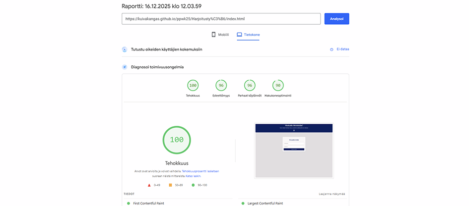

# Harjoitustyö

[Linkki harjoitustyöhön](./Harjoitustyö/index.html)

Sähköposti: maija@maija.fi
Salasana: 123456

### Sivuston kuvaus ja toteutus

Sivusto on kehitetty Haaga-Helia ammattikorkeakoulun Pilvipalvelut web-kehityksessä -kurssin harjoitustyönä. Kurssilla olemme perehtyneet  autentikoinnin, tietokantojen ja dynaamisten käyttöliittymien käyttöön. Sivusto on luotu HTML-, CSS- ja JavaScript-kielillä. Parcel-työkalulla sain tiedostot pakattua tehokkaasti ja luotua projektista dist-kansion.

Tällä sivustolla Helsinkiin matkaavat käyttäjät näkevät Helsingin sään reaaliajassa ja pystyvät sen pohjalta luoda pakkauslistaa, joka tallentuu sivustolle. Autentikoinnissa on käyettty Firebasea, säätä haetaan kolmannen osapuolen REST-API:lla (Openweathermap.org) ja pakkauslista tallennetaan firestore-tietokantaan. 

### Nielsen heuristiikkojen mukainen käytettävyys 

Käytettävyyttä arvioitiin Nielsenin heuristiikkojen mukaan kolmen käyttäjätestaajan avulla. 

Kaikki testaajat pitivät sivustoa visuaalisesti selkeänä, helposti ymmärretävänä ja helposti käytettävänä. Sivusto on responsiivinen, kaikista toiminnoista- ja virheistä tulee selkeä ilmoitus ja sivusto on johdonmukainen.

### Saavutettavuus

**Näkyvyys (Perceivable)** tekstin ja taustan väreissä on riittävä kontrasti. **Toiminnallisuus (Operable)** kaikki sivuston ominaisuudet ovat käytettävissä pelkän näppäimistön avulla. **Ymmärrettävyys (Understandable)** sivuston vuorovaikutus on selkeä ja elementit visuaalisesti yhtenäisiä. **Vahvistettavuus (Robust)** sivusto toimii eri selaimilla ja laitteilla.

## Harjoitustyön testaus

### Responsiivisuus

responsiivisuutta on testattu eri kokoisilla päätelaitteilla ja Chrome DevTools -työkalun avulla. Sivusto skaalautuu hyvin ja kaikki elementit asettuvat oikein näytön koosta riippumatta.

**Desktop** testattu 1920×1080 ja 1366×768 kokoisilla näytöillä.

 

**Mobiili** testattu eri kokoisilla mobiililaitteilla, skaalautuu kaikissa oikein.

 

**Tablet** testattu erikokoisilla tableteilla, skaalautuu kaikissa oikein.

 

### Toimivuus eri selaimilla

Testatut selaimet:
- Safari 26.1
- Microsoft Edge 143
- Google Chrome 143

**Tulos:** Sivusto toimii kaikilla testatuilla selaimilla.

### Sivujen latautumisaika

Sivujen latautumisaika testattu PageSpeed Insight työkalulla.

### Yhteenveto
Sivusto noudattaa Nielsenin heuristiikkojen periaatteita, täyttää WCAG:n keskeiset vaatimukset ja toimii moitteettomasti eri päätelaitteilla. Se on myös yhteensopiva kaikilla yleisimmillä selaimilla.

Suorituskyky ja latausajat ovat erinomaiset, ja käyttäjätestauksen perusteella sovelluksen käyttö on sujuvaa ilman tarvetta erilliselle ohjeistukselle.
